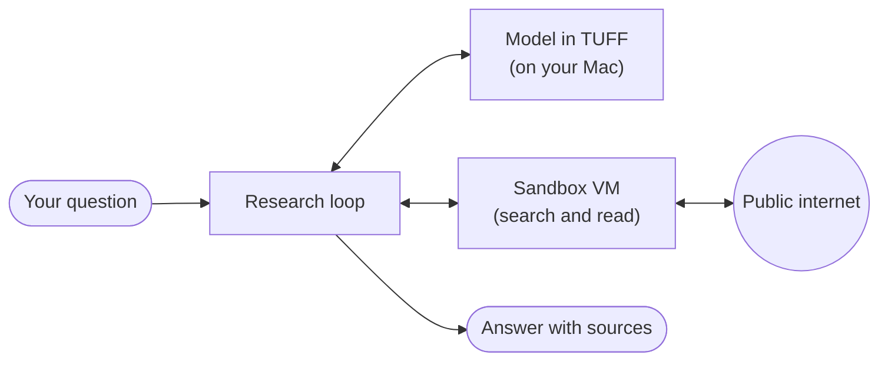

# TUFF + Web Research (fork)

This is a personal fork of **[TUFF](https://github.com/rexmhall09/TUFF)** by
[rexmhall09](https://github.com/rexmhall09). TUFF does all the hard work: it
runs language models locally on Apple Silicon Macs, with a native Mac app, a
Swift and Metal inference engine, command-line tools and a local
OpenAI-compatible server. All credit for TUFF itself goes to its author and
contributors. For TUFF downloads, documentation and support, please use the
[original repository](https://github.com/rexmhall09/TUFF).

TUFF's own README is unchanged and still lives at [README.md](https://github.com/Osiriss664/TUFF/blob/main/README.md).

## My goal

I want a model running on my own Mac to be able to **research the web**
safely: search, read pages, and write a short report with sources, without
sending my questions to a cloud service and without giving the model any
access to my computer.

The plan:

- **The model stays on the Mac.** TUFF serves it on `localhost` only.
  Ollama works too, since both speak the same OpenAI-style API.
- **The web stays in a sandbox.** Searching and fetching pages happen inside
  a throwaway Linux VM made with
  [Apple container](https://github.com/apple/container). The VM has a
  firewall that only allows public internet addresses (plus name lookups
  through the Mac), runs as a non-root user and has no access to my files or
  to other services on the Mac.
- **The model only gets web tools.** It can search and read pages, nothing
  else: no shell, no running files, no writing to the Mac except the final
  report. Everything that comes back from the web is treated as untrusted
  text.
- **Two ways to use it.** A `tuff research "your question"` command and a
  Research screen in the Mac app.

## How it works, in short

You ask a question. The model on your Mac decides what to search for, the
sandbox VM runs the searches and reads the pages, and the model writes an
answer with numbered sources. The research loop in between watches for
shortcuts: if the model answers without reading any page, or cites a page it
never opened, it is sent back to do it properly.

## Learn more

| Page | What it covers |
| --- | --- |
| [How it works](https://github.com/Osiriss664/TUFF/blob/main/.github/web-research/how-it-works.md) | The research steps, the model's two tools and the safety nets for weak answers. |
| [How it stays safe](https://github.com/Osiriss664/TUFF/blob/main/.github/web-research/safety.md) | The sandbox, the firewall, how it was tested and what it does not protect against. |
| [Setup and use](https://github.com/Osiriss664/TUFF/blob/main/.github/web-research/setup.md) | What you need, how to build it, and how to use it in the app and in Terminal. |
| [Test results](https://github.com/Osiriss664/TUFF/blob/main/.github/web-research/test-results.md) | Real runs with Qwen3.6 and Gemma 4 on a 16 GB Mac. |
| [Technical reference](https://github.com/Osiriss664/TUFF/blob/main/.github/web-research/technical.md) | For developers: components, the loop and its safeguards, the sandbox API and firewall, report format, configuration and tests. |

## Status

This is a work in progress that I run and test on my own Mac first.

- The feature lives on the
  [`feature/web-research`](https://github.com/Osiriss664/TUFF/tree/feature/web-research)
  branch ([draft pull request](https://github.com/Osiriss664/TUFF/pull/1)).
  It is not part of `main` and not in TUFF's own releases.
- It works with Qwen3.6 35B-A3B, Gemma 4 26B-A4B and Gemma 4 E4B. In the
  latest test, all 10 runs (5 questions, 2 models) finished with answers
  that cite only pages that were really read.
- Newest Mac-tested state: commit `d01bc38`. Two later rounds are pushed but
  still in testing on the Mac (relevant passages first, and stricter rules
  for which addresses the model may open); see the
  [test results](https://github.com/Osiriss664/TUFF/blob/main/.github/web-research/test-results.md).
- It was written with Claude Code (an AI coding assistant) and has been
  through several rounds of security review by a separate Claude session,
  plus prompt-injection tests on my Mac.
- The full technical guide is
  [docs/WEB_RESEARCH.md](https://github.com/Osiriss664/TUFF/blob/feature/web-research/docs/WEB_RESEARCH.md)
  on the feature branch.
- I have asked the TUFF project whether they would like this feature, in a
  [discussion](https://github.com/rexmhall09/TUFF/discussions/4).

The `main` branch here follows TUFF's own releases. This page and the pages
in [.github/web-research](https://github.com/Osiriss664/TUFF/tree/main/.github/web-research) are the only additions to it.

## Credits and license

- [TUFF](https://github.com/rexmhall09/TUFF) by rexmhall09, licensed under the
  [Apache License 2.0](https://github.com/Osiriss664/TUFF/blob/main/LICENSE). This fork keeps the same license.
- [Apple container](https://github.com/apple/container) for the sandbox VM.
