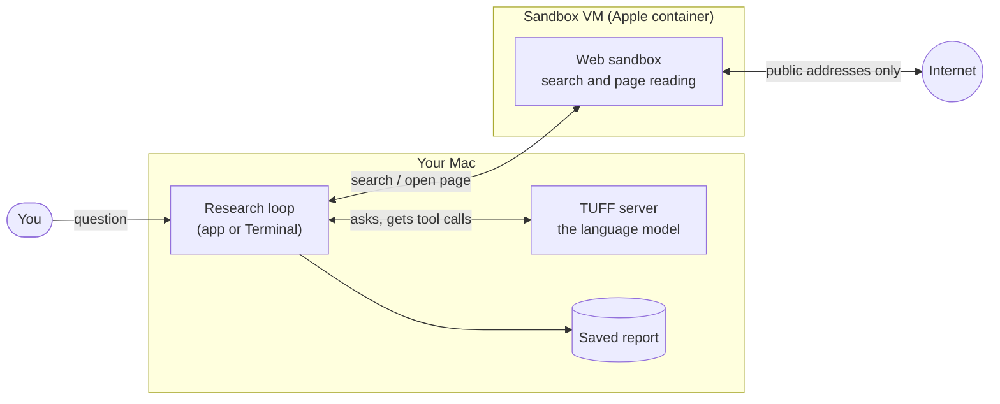

# How web research works

You ask a question. A language model running on your own Mac searches the
web, reads pages and writes an answer with numbered sources you can check.
This page walks through what happens, step by step.

[Back to the front page](../README.md) ·
[Safety](safety.md) · [Setup and use](setup.md) ·
[Test results](test-results.md) ·
[Technical reference](technical.md)

## The three parts

- **The model** runs in TUFF on your Mac, as it does for normal chats. It
  never touches the internet itself.
- **The web sandbox** is a small, throwaway Linux computer simulated on your
  Mac (a virtual machine, or VM) made with Apple's free
  [container](https://github.com/apple/container) tool. It runs the searches,
  downloads pages and turns them into plain text.
- **The research loop** sits in the middle. It sends the conversation to
  the model, carries out the searches and page reads the model asks for, and
  writes the final report. It runs in the TUFF app's Research screen or as
  the `tuff research` command in Terminal.

## The model's two tools

The model can ask for exactly two things, and nothing else:

| Tool | What it does |
| --- | --- |
| `web_search` | Searches the web (DuckDuckGo, or your own SearXNG) and returns titles, links and short previews. |
| `open_page` | Reads one page as plain text, in slices, so long pages fit. |

There is no tool for running programs, opening files or writing to your Mac.
So even if a web page contains hidden instructions for the model, the model
has nothing on your Mac it could use to follow them. See [Safety](safety.md).

## One research run, step by step

1. **Plan.** The model gets your question, today's date and a short research
   method: plan which facts it needs, search with several different wordings
   (also in English and in the question's language), read at least three
   independent pages, compare dates and claims, and check every item against
   each condition in the question.
2. **Search and read.** The model asks for searches and pages. The loop runs
   them in the sandbox and hands back the text, clearly marked as "untrusted
   web content". Each opened page gets a source number, such as [1].
3. **Keep track.** After every step the model sees a line like
   `Research so far: 2 searches, 1 page read, step 3 of 8.` A search it
   already ran (even with the words in another order) is refused instead of
   sent again.
4. **Make room.** Long conversations would outgrow what the model can hold
   in mind at once (its context window). The loop shortens older pages to the
   passages that match your question, so the newest material stays complete.
   This only makes room: the research keeps going, so long searches work.
5. **Answer.** The model writes the answer in your question's language: a
   short answer first, then details with source numbers, then what it could
   not verify.
6. **Save.** The report lists the answer, the sources that were really read
   and every search that was run. If the answer quotes a number that none of
   the pages it cites contain, a "Figure check" section lists it. The same
   goes for years and dates (in German and English forms). It also lists a
   figure that is on the page but not next to anything the sentence names,
   and names (such as product or group names) that the cited pages do not
   mention, and short labels such as "M1" or "F-35". Sentences without a
   source number are checked against all pages read, for names, full dates
   and longer numbers. This is only a hint: it cannot catch every wrong word,
   and a page may write a figure in words or in another unit. The check
   takes names only from what the model itself used: its search queries, the
   page titles and the web addresses. It skips HTTP error codes such as 403
   and knows German, English and Indonesian month names.

If your question asks for a number of sources ("at least 30 sources"), the
loop notices it. Each page read then shows "Page 12 of at least 30
requested", the model is reminded once to keep reading if it stops short, and
the report says when the number was missed. A cap ("at most 5 sources") or a
number that counts something else ("the last 30 years") is no request.

The number of steps is limited (8 by default, up to 100). When the budget is
used up, the model has to answer with what it has. The number of pages to
read, the results per search and each safety net below can be changed in the
app (**More Options**) or in Terminal; see [Setup and use](setup.md).

## Safety nets for weaker answers

Local models sometimes take shortcuts. The loop catches the common ones:

| What the model does | What the loop does |
| --- | --- |
| Answers from memory without searching | Asks it once to search first. |
| Answers from search previews without opening a page | Asks it once to open pages. |
| Searches three times without opening any page | Asks it once to open pages. |
| Still reads nothing two steps later | Opens the top search results itself and hands them over. |
| Does it again | Opens the top three search results itself, taking the first hit of every search before any second hit, and hands them over. |
| Repeats the same searches without reading anything | Refuses the repeats, then opens the top results for it. |
| Opens a page part it has already read | Refuses it. After older results were shortened to make room, it may read it once more. |
| Spends two steps in a row only repeating searches or page reads it already did | Stops the research there and asks for the answer, so no steps are wasted. The report notes the early stop. |
| Answers after only one search or one page | Asks it once to look wider: other words, another language, another source. |
| Runs out of steps, or is stopped that way, with fewer than three pages read | Opens more top results before the final answer. |
| Stops in the middle of the answer because it reached its length limit | Asks it once to continue exactly where it stopped, but only if the request still fits the model's context. If the model starts the answer over, that second copy is dropped. |
| Opens a web address it made up, and that address sends you to another site or the home page | The page does not count as a source and the model is told. Normal forwarding (for example from http to https) is fine. |
| Answers with fewer pages read than the question asked for | Asks it once to keep reading. If the number is still missed, the report says so. |
| Cites a source number for a page it never opened | Asks it once to rewrite the answer using only pages it read. Claims it cannot back up are dropped or marked as not verified. |
| Gives figures without source numbers, or no source numbers at all | Asks it once to add the source number after every claim taken from a page. |
| Answers in another language than the question asked for | Asks it once to write the whole answer in the right language. |
| Tries to search again when it should only write the answer | Tells it the tools are closed and asks again. If it tries again, asks plainly for the best answer from the pages it read. Only then are the tools switched off. |
| Runs out of room while thinking, before it answers | Keeps researching with its "thinking" turned off. |
| Thinks for more than 3 minutes on one step | Stops that step and asks again with its "thinking" turned off, for the rest of the question. |
| Fails with a server error while thinking | Asks again with its "thinking" turned off instead of giving up. |
| Fails with a server error with "thinking" already off | Sends the step once more. |
| Takes too long on one step, or ends without an answer | Asks again with its "thinking" turned off. |
| Takes too long on one step with "thinking" already off | Shortens older results and asks once more. |

The last three requests go out together as one request, so they cost at most
one extra model turn. If a problem remains, the report says so in a note at
the end, for example that only one search was run, that a citation matches
no page read, or that the answer is not in the question's language.

If a run fails or is stopped after it already searched or read a page, you
still get a report. It has no answer, says that the research ended early and
why, and lists the sources and searches so far.

While a run is going, your Mac does not go to sleep on its own (the screen
may still turn off, and closing the lid still puts it to sleep). The app
shows how long a run took as, for example, "19 s", "3 min" or "14 min 5 s".

## In testing

Two further rounds are pushed to the feature branch but have not been tried on
a Mac yet, so no results are claimed:

- **Relevant passages first.** With `--passages on` (off by default), a page
  is read as the passages that best match the question, ranked by BM25,
  instead of front to back.
- **Stricter page opening.** `open_page` only opens addresses the research
  showed (in a search result, in a page read or in the question), fetched in
  the spelling shown. Hidden Unicode format characters are stripped. The app
  starts a fresh sandbox for each question.

## What it cannot do

- Pages are read without running JavaScript, so some modern sites give
  little text.
- Some sites block all automated requests with a bot check (for example
  Indonesia's statistics office BPS), so they cannot be read.
- A model can still be fooled by a page that is simply wrong. The sources are
  listed so you can check.
- The search engine and the websites see your internet address, as with any
  web search.

The full technical guide is
[docs/WEB_RESEARCH.md](https://github.com/Osiriss664/TUFF/blob/feature/web-research/docs/WEB_RESEARCH.md)
on the feature branch.
