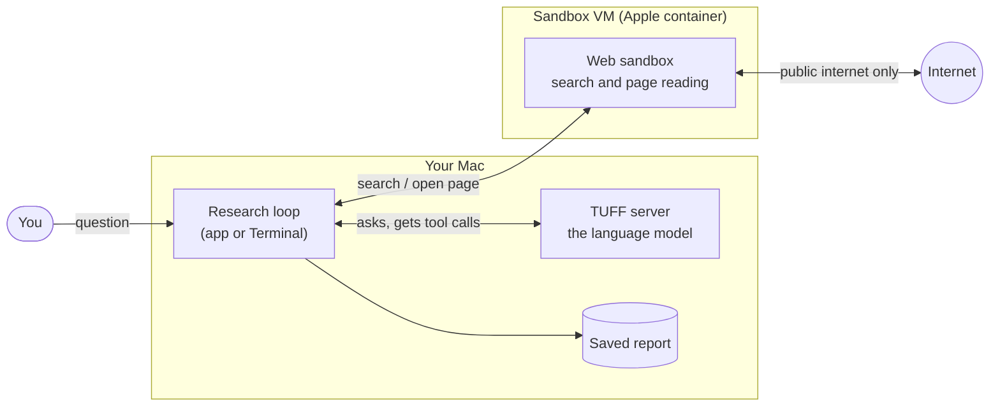

# How web research works

You ask a question. A language model running on your own Mac searches the
web, reads pages and writes an answer with numbered sources you can check.
This page walks through what happens, step by step.

[Back to the front page](../README.md) ·
[Safety](safety.md) · [Setup and use](setup.md) ·
[Test results](test-results.md)

## The three parts

- **The model** runs in TUFF on your Mac, as it does for normal chats. It
  never touches the internet itself.
- **The web sandbox** is a small, throwaway Linux computer simulated on your
  Mac (a virtual machine, or VM) made with Apple's free
  [container](https://github.com/apple/container) tool. It runs the searches,
  downloads pages and turns them into plain text.
- **The research loop** sits in the middle. It sends the conversation to
  the model, carries out the searches and page reads the model asks for, and
  writes the final report. It runs in the TUFF app's Research screen or as
  the `tuff research` command in Terminal.

## The model's two tools

The model can ask for exactly two things, and nothing else:

| Tool | What it does |
| --- | --- |
| `web_search` | Searches the web (DuckDuckGo, or your own SearXNG) and returns titles, links and short previews. |
| `open_page` | Reads one page as plain text, in slices, so long pages fit. |

There is no tool for running programs, opening files or writing to your Mac.
So even if a web page contains hidden instructions for the model, the model
has nothing on your Mac it could use to follow them. See [Safety](safety.md).

## One research run, step by step

1. **Plan.** The model gets your question, today's date and a short research
   method: plan which facts it needs, search with several different wordings
   (also in English and in the question's language), read at least three
   independent pages, compare dates and claims, and check every item against
   each condition in the question.
2. **Search and read.** The model asks for searches and pages. The loop runs
   them in the sandbox and hands back the text, clearly marked as "untrusted
   web content". Each opened page gets a source number, such as [1].
3. **Keep track.** After every step the model sees a line like
   `Research so far: 2 searches, 1 page read, step 3 of 8.` A search it
   already ran (even with the words in another order) is refused instead of
   sent again.
4. **Make room.** Long conversations would outgrow what the model can hold
   in mind at once (its context window). The loop shortens older pages to the
   passages that match your question, so the newest material stays complete.
5. **Answer.** The model writes the answer in your question's language: a
   short answer first, then details with source numbers, then what it could
   not verify.
6. **Save.** The report lists the answer, the sources that were really read
   and every search that was run.

The number of steps is limited (8 by default, adjustable). When the budget is
used up, the model has to answer with what it has.

## Safety nets for weaker answers

Local models sometimes take shortcuts. The loop catches the common ones:

| What the model does | What the loop does |
| --- | --- |
| Answers from memory without searching | Asks it once to search first. |
| Answers from search previews without opening a page | Asks it once to open pages. |
| Does it again | Opens the top three search results itself, taking the first hit of every search before any second hit, and hands them over. |
| Repeats the same searches without reading anything | Refuses the repeats, then opens the top results for it. |
| Answers after only one search or one page | Asks it once to look wider: other words, another language, another source. |
| Runs out of steps with fewer than three pages read | Opens more top results before the final answer. |
| Cites a source number for a page it never opened | Asks it once to rewrite the answer using only pages it read. Claims it cannot back up are dropped or marked as not verified. |
| Takes too long on one step, or ends without an answer | Asks again with its "thinking" turned off. |

If a problem remains, the report says so in a note at the end, for example
that only one search was run or that a citation matches no page read.

## What it cannot do

- Pages are read without running JavaScript, so some modern sites give
  little text.
- A model can still be fooled by a page that is simply wrong. The sources are
  listed so you can check.
- The search engine and the websites see your internet address, as with any
  web search.

The full technical guide is
[docs/WEB_RESEARCH.md](https://github.com/Osiriss664/TUFF/blob/feature/web-research/docs/WEB_RESEARCH.md)
on the feature branch.
