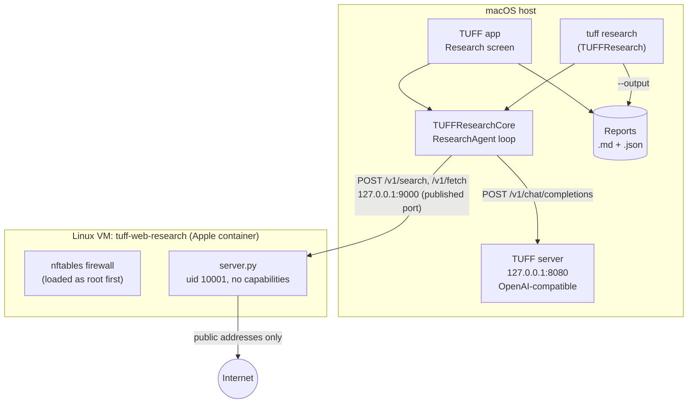

# Technical reference

This page is for developers. It describes how web research is built: the
components, the research loop and its safeguards, the sandbox and its
firewall, the interfaces between the parts, the report format, configuration
and tests. Everything here refers to the
[`feature/web-research`](https://github.com/Osiriss664/TUFF/tree/feature/web-research)
branch (commit `e5401a8` at the time of writing: the research code
as tested on a Mac at `aaa9fca`, on top of TUFF 7.3.0). File paths are relative to
that branch.

[Back to the front page](../README.md) ·
[How it works](how-it-works.md) · [Safety](safety.md) ·
[Setup and use](setup.md) · [Test results](test-results.md)

## Contents

- [Architecture](#architecture)
- [Components](#components)
- [The research loop](#the-research-loop)
- [Safeguards in the loop](#safeguards-in-the-loop)
- [Context management](#context-management)
- [Model API](#model-api)
- [Sandbox API](#sandbox-api)
- [Sandbox VM and firewall](#sandbox-vm-and-firewall)
- [Untrusted text handling](#untrusted-text-handling)
- [Reports](#reports)
- [Configuration](#configuration)
- [Tests](#tests)
- [Design decisions](#design-decisions)

## Architecture



Data flows one way: the host calls the VM through the published port, the
VM never calls the host (the firewall refuses the Mac's address, except DNS on port 53). The model
never talks to the sandbox directly; every tool call goes through the loop,
which validates it.

## Components

| Path | Role |
| --- | --- |
| `Sources/TUFFResearch/Core/ResearchAgent.swift` | The loop (`ResearchAgent.run`), tool definitions, system prompt, nudges and fallbacks, context compaction (`State.compact`), report model (`ResearchReport`) and progress events (`ResearchEvent`). |
| `Sources/TUFFResearch/Core/ResearchChatClient.swift` | OpenAI-style chat client for the TUFF server, context-window lookup via `/v1/models`. |
| `Sources/TUFFResearch/Core/ResearchSandboxClient.swift` | Client for the sandbox API. |
| `Sources/TUFFResearch/Core/ResearchText.swift` | Sanitising: control and invisible characters, inert Markdown, terminal-safe output. |
| `Sources/TUFFResearch/Core/ResearchArguments.swift` | CLI flags, defaults, loopback-only endpoint check. |
| `Sources/TUFFResearch/Core/ResearchTransport.swift` | HTTP transport protocol and `ResearchError`. |
| `Sources/TUFFResearch/Command/main.swift` | The `TUFFResearch` executable: progress on stderr, report on stdout. |
| `Sources/TUFFCommand/Core/TUFFCommand.swift` | `tuff research …` forwards to the `TUFFResearch` binary beside it. |
| `Sources/TUFFApp/Research/` | App side: run controller, sandbox and model-server controllers, report store, answer formatter. |
| `Sources/TUFFApp/Mac/Research/ResearchWorkspaceView.swift` | The Research screen (Command-2). |
| `Sandbox/web-research/` | The VM image: `Containerfile`, `entrypoint.sh`, `firewall.nft`, `server.py`, pinned `requirements.txt`, Python tests and injection fixtures. |
| `Scripts/research_sandbox.sh` | `build`, `start`, `stop`, `status`, `selftest` for the VM. |
| `Scripts/research_injection_check.py` | Prompt-injection harness against the fixtures. |

The engine is shared: the CLI and the app both run `ResearchAgent`, and only
the presentation of `ResearchEvent`s differs.

## The research loop

`ResearchAgent.run(question:)` in outline:

1. Fetch the model's context window from `/v1/models` (if listed) and set the
   prompt budget.
2. Start the conversation with the system prompt (research method, today's
   date, the untrusted-marker rule) and the question.
3. For each step `1…maxSteps` (default 8, at most 100):
   - Send the conversation with tools allowed (`tool_choice: "auto"`).
   - If the reply has tool calls: run up to `maxToolCallsPerTurn` (4) of them,
     append each result as a `tool` message, and append a progress line
     (`Research so far: N searches (…), M pages read, step s of n.`) to the
     last result of the turn.
   - If the reply was cut off at the token limit while thinking, with no
     answer and steps left: continue with the next step, reasoning off.
   - If the reply has no tool calls: either send a nudge and continue (see
     below), or take it as the answer.
4. If the steps run out: append a final request without tools
   (`tool_choice: "none"`), possibly with top-up pages, and take that answer.
5. Check the answer's citations; if needed, ask once for a rewrite.
6. Return a `ResearchReport`.

`web_search` returns up to `searchResults` (5) results per query. Each new
URL read with `open_page` gets the next source number; re-reading the same
URL (any offset) keeps its number, and the result tells the model so.

## Safeguards in the loop

Each one fires at most once per run unless noted (the context-overflow retries
can happen in every step). Defaults are shown; most can be changed (see
[Configuration](#configuration)). Constants are in `ResearchAgent` and
`ResearchOptions`.

| Trigger | Action | Event |
| --- | --- | --- |
| Answer without any tool call | Ask to search first (`searchFirstRequest`). | `askingToSearchFirst` |
| Answer after searching, no page read | Ask to open pages (`readPagesRequest`). | `askingToReadPages` |
| Same again (or at once with `--nudges off`) | Loop opens top results itself: `minimumPagesRead` (3) pages, round-robin over all searches (first hit of each search, then second hits), up to `autoOpenAttempts` (6) URLs tried, each capped at `min(pageChars, max(500, budget/2/wanted))`. Off with `--auto-open off`. | `openingTopResults` |
| Repeated search (case, spacing, quotation marks and word order ignored) | Refused without reaching the search engine; after `repeatsBeforeOpening` (2) refusals with no page read, the loop opens top results as above (not with `--auto-open off`). | `repeatedSearchRefused(query)` |
| Answer with fewer than 2 searches or 2 sources (not after auto-open, not at the token limit) | Ask once to look wider (`searchMoreRequest`); the draft is kept as a fallback if the next answer is empty or cut off. | `askingToSearchMore` |
| Step budget used up with fewer than `minimumPagesRead` pages read | Open unread top results (per-page cap `min(pageChars, budget/2/missing)`); skipped when that cap would be under 500 characters or a fallback draft is held. | `openingTopResults` |
| Answer cites numbers that match no read source, at least one source read | Ask once, reasoning off, to rewrite from read pages only. Kept only if complete, citing fewer unread numbers and no new one, and at least a third as long; otherwise the original stays. | `revisingUnreadCitations` |
| Turn cut off at the token limit while thinking, with no answer and steps left | Continue the research with the next step; reasoning stays off for the rest of the run. On the last step, or with reasoning already off, it is treated as an empty answer. | `continuingAfterCutOff` |
| Empty answer (often reasoning used all tokens) | Ask once more with reasoning off (`answerNowRequest`); error `noAnswer` if empty again. | `retryingEmptyAnswer` |
| Step with reasoning on exceeds the request timeout | Retry the step once with reasoning off; reasoning stays off for the rest of the run. With reasoning already off, the run stops with an error. | `retryingAfterTimeout` |
| Context overflow reported by the server | Lower the characters-per-token estimate, compact to half budget and retry; if it overflows again, shorten even the newest results and retry once more. | `shortenedOlderResults` |

Known limit: late in a long run, a model can keep repeating a search that is
refused every time, which uses up its remaining steps (Qwen3.6 did from step
25 of a 40-step run). Auto-open only helps when no page has been read yet. A
fix is proposed.

No nudge is sent on the last step, since there is no step left to answer in.
The three nudges are switched off together with `--nudges off`, and the
rewrite with `--rewrite off`.
The report adds notes for: budget exhausted, no pages read, answer cut off
at the token limit, only one search, and unknown citations.

## Context management

The prompt budget in characters is
`min(64000, max(window − maxTokens − 256, window × 2/5) × charsPerToken)`,
or 16,000 when the server lists no window, or `--context-chars` if set.
`charsPerToken` is calibrated from the server's reported `prompt_tokens`.
Before each request, `State.compact` shortens older messages until the
conversation fits (aiming at about three quarters of the budget). The system
prompt, the question, the newest tool result and the last message are not
shortened, except in the emergency step after a second context overflow.
In order:

1. A page read twice keeps only its newest copy.
2. Older pages are cut to about 900 characters: their lead and the passages
   that contain words from the question and the searches, in page order.
   Older search results lose their snippets at the same time, and long older
   draft answers (over 600 characters) are cut to their start.
3. If that is not enough, the passages are cut to about 300 characters.
4. If that is still not enough, an older result shrinks to its first line.

Compaction is done by the loop, never by the model, so page text cannot steer
what is kept. Compaction only makes room: it never ends a run. The system
prompt tells the model that shortened older results are normal on a long
search and that it should keep searching and reading until it can answer
well or the steps run out.

## Model API

The loop uses the TUFF server's OpenAI-compatible endpoint, so any server
with the same API (for example Ollama) works.

`POST /v1/chat/completions`:

```json
{
  "model": "default",
  "messages": [ ... ],
  "tools": [ web_search, open_page ],
  "tool_choice": "auto" | "none",
  "max_tokens": 2048,
  "stream": false,
  "enable_thinking": true | false
}
```

- `enable_thinking` is sent only when set (`--thinking`, `--show-thinking`,
  or a retry that turns it off). When a request that turns it off gets
  `unsupported_parameter` back (GPT-OSS), it is sent again with the client's
  own setting, and so are the later ones.
- `max_tokens` defaults to 2048, or 8192 with reasoning on.
- Reasoning returned as `reasoning_content` is shown as progress only and is
  never sent back to the model.
- Timeout for model calls: `--step-timeout` minutes (default 30) per HTTP
  request; sandbox calls keep 1,800 s. Both are set in
  `URLSessionResearchTransport`. Replies are not streamed, so this is in
  effect the limit for one model step.

Tools:

| Name | Parameters | Result to the model |
| --- | --- | --- |
| `web_search` | `query` (string) | A list of title, URL and snippet per result (no source numbers yet). |
| `open_page` | `url` (http or https), `offset` (integer, optional) | `Source [n]: title`, the URL, the text slice inside untrusted markers, and the offset to continue from if the page is longer. |

Malformed arguments, blocked URLs and fetch errors come back to the model as
tool errors, so it can try something else.

## Sandbox API

`Sandbox/web-research/server.py`, published on `127.0.0.1:9000`. JSON in,
JSON out.

| Endpoint | Body | Response |
| --- | --- | --- |
| `GET /health` | | `{"status": "ok"}` |
| `POST /v1/search` | `{"query": str (1–400 chars), "max_results": int (1–10)}` | `{"query", "results": [{"title", "url", "snippet"}]}` |
| `POST /v1/fetch` | `{"url": str, "offset": int ≥ 0, "max_chars": int (1–20000)}` | `{"url", "title", "text", "offset", "next_offset" (or null), "total_chars"}` |

Errors are `{"error": {"message", "code"}}` with codes such as
`invalid_argument`, `blocked_address`, `dns_error` and `forbidden_host`.

Request rules: only `application/json` POSTs, request bodies up to 64 KB,
and the `Host` header must be a loopback name (this blocks DNS rebinding and
cross-origin requests from a browser).

Fetch rules:

- http on port 80 and https on port 443 only.
- Every resolved address must be globally routable: no loopback, private,
  link-local, carrier-grade NAT, multicast or reserved ranges, and no IPv6
  forms that embed IPv4 (NAT64, 6to4, Teredo).
- The connection goes to the address that was checked, so DNS cannot change
  between check and connect.
- Up to 5 redirects, each checked the same way.
- 5 MB download cap, 15 s per network wait (`FETCH_TIMEOUT`), 45 s per
  HTTP request overall (each redirect hop gets its own); only HTML and plain text are read.
- Text extraction (trafilatura, with a fallback parser) runs in a separate
  process stopped after 15 s (`EXTRACT_TIMEOUT`), on at most 2 million
  characters.
- Search uses DuckDuckGo's HTML results, or SearXNG when `SEARXNG_URL` is
  set; a dropped connection or stall is retried once.

## Sandbox VM and firewall

`Scripts/research_sandbox.sh build` builds the `tuff-web-research` image from
`Sandbox/web-research/Containerfile` (pinned Python base image by digest,
Python packages by hash; `nftables` comes from Debian at build time). The
builder VM is stopped again afterwards unless it was already running.

`start` runs a fresh VM (any older one is deleted) with:

- read-only root filesystem, scratch `/tmp` only, no host folders mounted;
- 2 CPUs, 1 GB memory, at most 512 processes;
- all Linux capabilities dropped except the four the entrypoint needs to
  load the firewall and switch user;
- the port published on `127.0.0.1` only (`TUFF_RESEARCH_SANDBOX_PORT`);
- `--rm`, so the VM is deleted when it stops.

`entrypoint.sh` loads `firewall.nft` as root and refuses to start if that
fails. It adds DNS (port 53, UDP and TCP) to the VM's configured name servers,
and, if `SEARXNG_URL` is set, one exception for that address and port. Then
`server.py` drops to uid 10001 with no capabilities and cannot regain them.

`firewall.nft`, output chain, default policy drop:

- loopback and established/related traffic allowed;
- IPv4 private, loopback, link-local, CGNAT, documentation, benchmarking and
  multicast ranges refused (TCP reset, otherwise ICMP reject);
- other IPv4 allowed;
- IPv6 `2001::/32`, `2001:db8::/32`, `2002::/16` refused; global unicast
  `2000::/3` allowed; everything else refused.

The rules match address ranges, not devices. A host on the local network or
the Mac itself is refused at its private address, but not at a public IPv4
or global IPv6 address of its own, if the VM has a route to it.

The app verifies this from outside before every question: it reads the
loaded ruleset with `container exec` and checks the policy, the refused
ranges and that nothing is allowed ahead of them except loopback, replies
and the DNS or SearXNG exceptions, and that the server process has uid 10001
and no capabilities. Questions are disabled until it passes.

`selftest` checks from inside the VM that the Mac, loopback, private ranges,
metadata addresses, a name resolving to 127.0.0.1, other ports and other
schemes are refused by the API; that raw connections as uid 10001 to the Mac,
routers and metadata fail; that a scan of every TCP port on the Mac finds
only DNS; that a foreign `Host` header and a browser-style POST are refused;
and that a public page still loads.

## Untrusted text handling

- Page text is wrapped in `untrustedOpen` / `untrustedClose` markers. Copies
  of the markers inside a page are removed repeatedly, so a page cannot close
  the block early.
- Control characters (terminal escape codes) and invisible characters
  (zero-width characters, variation selectors other than the emoji one, the
  Unicode tag block) are removed in the VM and again on the host, from
  titles, text, snippets and everything printed or saved.
- Queries shown in progress are collapsed to one line of at most 200
  characters.
- Report Markdown is made inert: images become links, `<` is escaped, and
  links other than http and https are reduced to their text, including link
  definitions inside quotes and lists.

## Reports

`ResearchReport.markdown` produces:

```markdown
# <question>

<answer>

## Sources

1. [Title](https://…)
2. …

## Searches

- query one
- query two

_One italic paragraph per note, if any: unread citations, budget used up,
no pages read, cut off at the token limit, only one search._
```

The Sources and Searches sections appear only when they have entries.

The CLI prints this to stdout (`--output` also writes it to a file that must
not exist yet). The app saves each report twice in
`~/Library/Application Support/TUFF/Research Reports`: Markdown, and JSON
(`SavedResearchReport`) with `id`, `question`, `answer`, `markdown` (the
report text), `sources` (`number`, `title`, `url`), `model`, `createdAt`,
`durationSeconds`, `budgetExhausted`, `answerWasCutOff`, `savedSearchQueries`,
`unknownCitations` and the progress `steps`. The two optional keys are
missing in reports saved by older versions. Deleting a report in the app moves both files to the Trash.

## Configuration

CLI (`tuff research <question> [options]`):

| Flag | Default | Meaning |
| --- | --- | --- |
| `--model <name>` | `default` | Model the server should use; `default` is the one selected in TUFF. |
| `--server <url>` | `http://127.0.0.1:8080` | TUFF server; must be loopback. |
| `--sandbox <url>` | `http://127.0.0.1:9000` | Sandbox; must be loopback. |
| `--max-steps <1…100>` | 8 | Model turns that may use tools. |
| `--max-tokens <64…32768>` | 2048 (8192 with reasoning) | Completion tokens per turn. |
| `--page-chars <500…20000>` | 3000 | Page text per read. |
| `--context-chars <2000…1000000>` | from the context window | Fixed prompt budget. |
| `--thinking on\|off` | model's own | Reasoning for Gemma and Qwen. |
| `--show-thinking` | off | Turn reasoning on and print it. |
| `--output <file.md>` | | Also write the report to a new file. |
| `--search-results <1…10>` | 5 | Results per search. |
| `--tool-calls <1…8>` | 4 | Tool calls the model may make per turn. |
| `--min-pages <1…6>` | 3 | Pages to read: asked for in the prompt, and the target of the loop's own page opening. |
| `--auto-open on\|off` | on | The loop opens top results itself when too few pages are read. |
| `--nudges on\|off` | on | Ask once to search first, to open pages and to look wider. |
| `--rewrite on\|off` | on | One rewrite when the answer cites pages that were never read. |
| `--step-timeout <1…60>` | 30 | Minutes one model step may take before it is retried without reasoning. |
| `--quiet` | off | No progress on stderr. |
| `--help`, `-h` | | Print the options. |
| `--` | | End of options; the rest is the question. |

The app's Research screen has the same settings with the same defaults and
ranges: Steps and Show thinking on the main row, the rest under **More
Options** (Thinking, token limit, page text per read, prompt budget, results
per search, tool calls per step, pages to read, step time limit, and switches
for auto-open, nudges and the rewrite). The app keeps them between launches
(`@AppStorage`), and **Restore Defaults** resets them. Token limit, page text
and prompt budget are picked from a few fixed sizes. `ResearchRunSettings` clamps every
value to the CLI's range. Show thinking is on by default in the app, which
turns reasoning on and raises the token limit to 8192.

The limits that protect the Mac are not settings: the sandbox, its firewall,
the loopback-only addresses, the fetch size and time limits and the report
rules stay fixed.

Sandbox environment (set before `research_sandbox.sh start`):

| Variable | Effect |
| --- | --- |
| `TUFF_RESEARCH_SANDBOX_PORT` | Host port for the sandbox (default 9000). |
| `TUFF_RESEARCH_DNS` | Space-separated public resolvers instead of the Mac's DNS. |
| `SEARXNG_URL` | Use this SearXNG instance for search; gets one firewall exception. |

## Tests

```sh
Scripts/test.sh --filter TUFFResearch                     # loop and CLI, fake services
python3 -m unittest Sandbox/web-research/test_server.py   # sandbox policy, no network
Scripts/research_sandbox.sh selftest                      # live VM boundaries
python3 Scripts/research_injection_check.py --base-url <public fixture URL> --repeat 3
```

- `Tests/TUFFResearch/ResearchAgentTests.swift` drives the loop with scripted
  model replies and a fake sandbox (56 tests), covering tool handling,
  nudges, fallbacks, compaction, the rewrite, the settings and sanitising.
- `Tests/TUFFApp/Research/` covers the app side (40 tests): run control,
  report store, formatter and service controllers.
- The injection harness serves four hostile pages
  (`Sandbox/web-research/fixtures/injection`) and fails a run if the model
  opened a planted address or lost the page's real facts.

Live results are on the [test results page](test-results.md).

## Design decisions

- **Two tools only.** No shell, file or generic HTTP tool, so injected
  instructions have nothing to act through. The report is the only host
  write.
- **The web in a VM, the model on the host.** The VM gets no GPU and no host
  folders; only sanitised text crosses back.
- **Defence in depth.** Address checks in `server.py` and the same rules in
  the VM firewall, so taking over the server process does not open the
  network.
- **The loop, not the model, makes safety decisions:** which pages to open in
  fallbacks, what to compact, which citations are valid.
- **Plain OpenAI API.** No TUFF-internal interfaces, so the loop works with
  other local servers too.
- **No JavaScript.** Pages are fetched and parsed as static HTML, which keeps
  the sandbox small at the cost of some sites returning little text.

## Keeping these pages current

After every larger change on `feature/web-research` (a new feature, changed
research behaviour, new or changed settings, or a security change) has been
pushed and tested on a Mac, this page and the plain-language pages are
updated on `main` as part of finishing that change. The commit named at the
top of this page says which version the pages describe.
