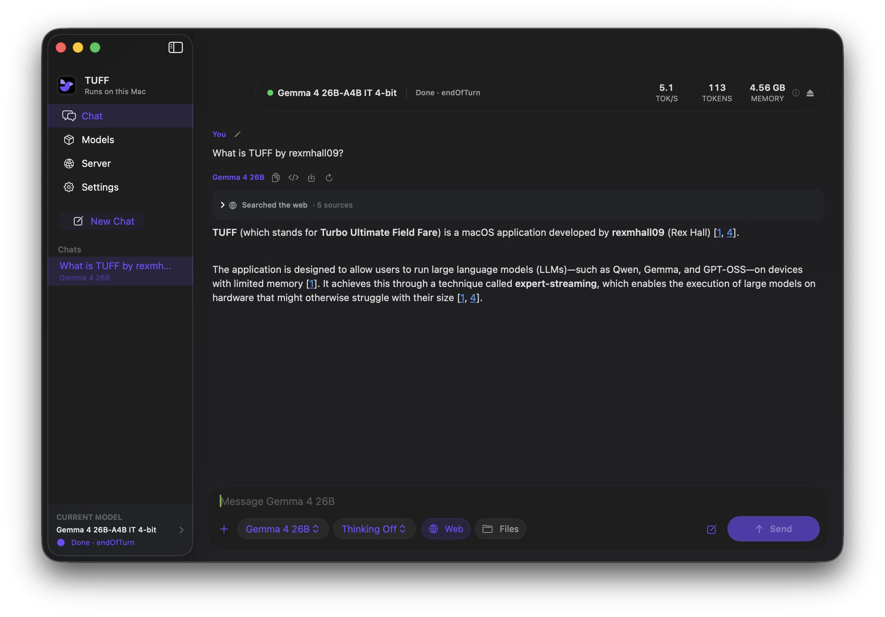
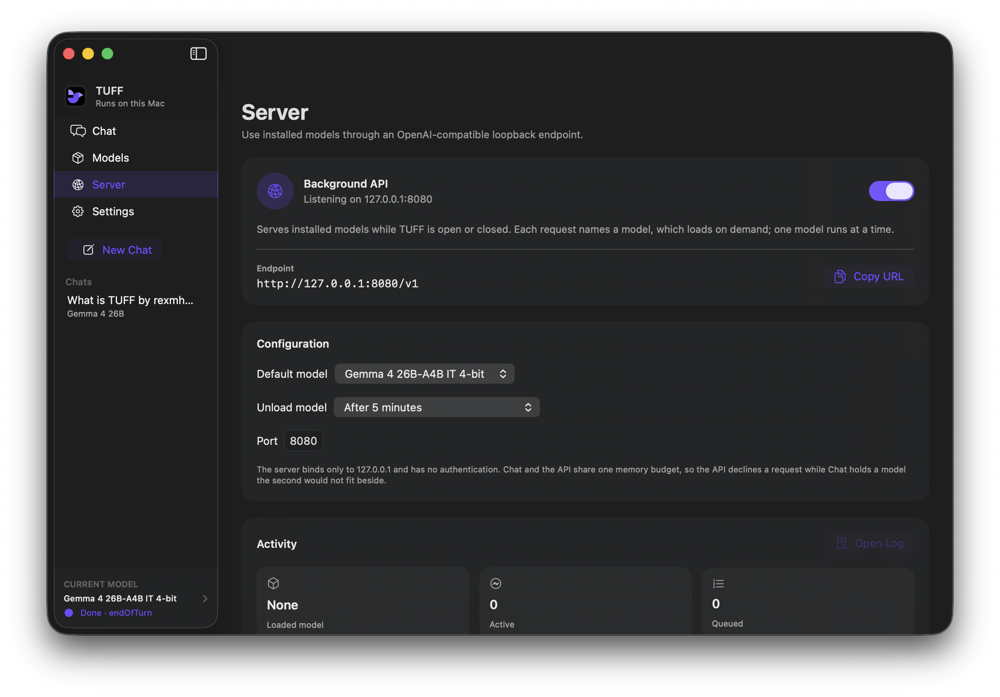

<p align="center">
  
</p>

<h1 align="center">TUFF</h1>

TUFF runs language models locally on Apple Silicon. It includes a native Mac
chat app, model downloader, Swift and Metal inference engine, command-line
tools, and a local OpenAI-compatible server.

[Download latest](https://github.com/rexmhall09/TUFF/releases/latest) ·
[Website](https://rexmhall09.github.io/TUFF/) · [Contribute](CONTRIBUTING.md)



TUFF keeps shared weights file-backed and reads routed experts into a bounded
cache. This lets supported mixture-of-experts checkpoints run without loading
all their experts into memory. Streaming has a cost: a model's disk size alone
does not tell you its memory needs or how quickly it will answer.

## Why TUFF

TUFF combines a native Swift Mac app with bounded expert streaming, model
downloads, image companions, a CLI and a local server. Its app and inference
engine are [open source](LICENSE), and packaged updates use signed archives.
The practical benefit is access to supported models whose installs exceed
your Mac's memory: GPT-OSS 120B, Flash Next and MiniMax all completed the
[release smoke checks](docs/MODEL_VALIDATION.md) on a 16 GB M2 MacBook Air.
That report records their measured rates and variation.

TUFF focuses on a small catalog with model-specific runtimes and a native Mac
experience. It is an inference engine with a useful chat interface; other apps
and agents can use its local server. See the [release evidence](docs/RELEASE_EVIDENCE.md)
for measured behavior and the limits of what has been checked.

## New in 8.0

- Search the web or folders you choose from chat, with visible tool activity,
  numbered sources and Markdown export. Web and Files are optional.
- Return to recent conversations without processing the entire history again,
  within a shared memory budget that releases optional states under pressure.
- Reuse exact tokenization inputs within a small CPU cache.
- Receive reasoning separately from answers and inspect request timings
  through the local API.
- Install a smaller app package that shares one inference executable across
  chat, the decode service and command-line tools.
- Install and update through Homebrew using this repository as the tap.

## Install

You need an Apple Silicon Mac with macOS 15 or newer.

1. Download the ZIP from the [latest release](https://github.com/rexmhall09/TUFF/releases/latest).
2. Extract it and move `TUFF.app` into Applications.
3. Open TUFF and choose a checkpoint in Models.

The app is ad-hoc signed, not notarized. macOS may block the first launch. Use
Control-click > Open, or allow it in System Settings > Privacy & Security.
You can inspect the source and build it yourself instead.

### Homebrew

The same release ZIP is available through TUFF's own tap. No separate tap
repository or source build is needed:

```sh
brew tap rexmhall09/tuff https://github.com/rexmhall09/TUFF.git
brew install --cask rexmhall09/tuff/tuff
```

This installs `TUFF.app` and puts `tuff` on your command line. For updates:

```sh
brew update
brew upgrade --cask rexmhall09/tuff/tuff
```

The app's signed in-app updater also works. Homebrew verifies the release
ZIP's pinned checksum. It does not notarize the app or bypass macOS first-open
approval. If you already installed TUFF manually, Homebrew may refuse to
replace the existing app. Keep your models, chats and settings, and follow
Homebrew's message rather than forcing an overwrite. A normal cask uninstall
keeps TUFF's user data.

### Verify a download

Check the downloaded archive against the checksum from the same release:

```sh
shasum -a 256 -c TUFF-vVERSION-macos-arm64.zip.sha256
```

Sparkle checks for updates automatically and verifies archives against the
embedded EdDSA public key. Update preferences are in Settings.

## Use the app

- **Chat** saves named conversations and restores them after a restart. Each
  answer identifies its model. Chat supports reasoning, Markdown, mathematical
  notation, image and file attachments, and optional web and folder search
  with numbered, clickable sources. Going back to a recent chat continues from
  its kept model state instead of processing the whole conversation again.
- **Models** installs the nine supported text checkpoints. Optional image
  companions are separate downloads on the model card.
- **Server** runs the Background API, a loopback endpoint that starts at login
  and works whether TUFF is open or closed. It loads the installed model each
  request names and unloads it after a configurable idle delay.
- **Settings** controls context, sampling, expert cache, prefill, and updates.
  Settings are saved per model.

### Web and file search

The **Web** and **Files** buttons beside the model picker let the model search
for the next message. Both are off until you turn them on.

- **Web** searches with DuckDuckGo by default, which needs no key. Brave
  Search and Tavily work with your own API key, stored in your Keychain and
  never shown to the model, saved in chats or written to logs. Searches send
  only the model's query to the provider you chose. DuckDuckGo may refuse or
  challenge automated searches; TUFF says so and does not work around it or
  switch providers. The model can read pages that search returned or that you
  wrote in your message, over HTTP or HTTPS, up to 2 MB, with at most five
  redirects. Connections use checked public addresses, including after a
  redirect. Local and private network addresses are refused. Web PDFs are
  parsed in a separate process with page, output and time limits; this is not
  a virtual machine or a security sandbox.
- **Files** searches folders you add in the open panel, and nothing else.
  TUFF indexes text, Markdown, source code, CSV, JSON, YAML and PDF files with
  a small full-text index in `~/Library/Caches/TUFF/LocalSearch`, without an
  embedding model. Indexing is incremental, skips symbolic links, hidden and
  build folders and files over 2 MB (64 MB for PDF), and pauses while a model
  is generating. Removing a folder deletes its part of the index.

After a chat has used local documents, images or folder-search results, web
search queries are limited to terms you wrote in your current message.
For example, write "search for Swift actors" to allow that query. This keeps
the model from choosing web queries based on private material in the chat.
Pages from search results and URLs you explicitly provide can still be read.

Each answer shows what was searched, with the queries and the sources found.
Sources are numbered across the chat; a citation such as [2] opens its web
page or reveals its local file in Finder. A number that matches no retrieved
source stays plain text and is pointed out. Retrieved text cannot enable tools
or widen the folders searched.
It can still contain false information or instructions intended to mislead a
model, so check the sources behind an answer. Answers can be saved, with their
sources, as Markdown.

One answer may use up to 4 rounds of tools, 3 calls per round, 8 web requests,
6 file searches and 120 seconds of tool time. Results are shortened to fit the
model's context. Stop cancels searches, page reads and generation. A tool call
the model writes incorrectly is never run; TUFF generates once more, then
reports the problem. Web and file search were checked with a real tool round
on Gemma 4 E2B, E4B, 12B and 26B, Qwen3.6, Qwen3.8 Flash Next and GPT-OSS
20B. GPT-OSS 120B and MiniMax M2.7 support tools but have not been checked,
and the app says so.

### Models and memory

| Checkpoint | Text install | Minimum unified memory | Image companion |
| --- | ---: | ---: | --- |
| Gemma 4 E2B IT | 2.64 GB | 8 GB | Optional |
| Gemma 4 E4B IT | 4.23 GB | 8 GB | Optional |
| Gemma 4 12B IT QAT | 10.98 GB | 16 GB | Optional |
| Gemma 4 26B-A4B IT | 14.29 GB | 8 GB | Optional |
| Qwen3.6 35B-A3B | 19.55 GB | 8 GB | Optional |
| GPT-OSS 20B | 13.79 GB | 16 GB | No |
| GPT-OSS 120B | 65.29 GB | 16 GB | No |
| MiniMax M2.7 | 128.71 GB | 16 GB, M2 or newer | No |
| Qwen3.8 Flash Next | 110.90 GB | 16 GB, M2 or newer | Optional |

Install sizes use decimal GB. Gemma and Qwen offer thinking on or off; GPT-OSS
offers low, medium or high reasoning. MiniMax always reasons.

These are catalog eligibility floors. This release's real-model validation
uses a 16 GB M2 MacBook Air; it does not establish coverage on 8 GB Macs or
other Apple Silicon generations. Image companions require M2 or newer.

Auto chooses context and expert-cache settings within 75% of installed unified
memory. It keeps the qualified cache count and raises it to the chunked-prefill
minimum only when the estimate fits. The corrected GPT-OSS accounting can
therefore select fewer slots than earlier releases. Manual settings are
checked against the same estimate.

The estimate includes all layers' expert slots, context KV storage,
chunk-dependent prefill scratch, sliding-window rings, and a conservative
allocation-growth reserve. It is an admission estimate, not measured resident
memory or a guarantee against memory pressure. Historical working-set
allowances remain in the baseline. Physical residency can differ because
weights and expert reads are file-backed.

Prefill groups prompt tokens into chunks and uses batched projections where
supported. The recommended chunk is 256 for dense models, 512 for MoE models
whose install fits installed memory, and 2,048 for larger MoE models (1,024
below 16 GB). Larger chunks consume more scratch and ring memory. CLI callers
can choose an explicit chunk size; the server uses the recommended one.

**Bypass model restrictions** permits loading beyond the eligibility and
estimated-memory gates. Such settings may swap or fail to allocate.

### Benchmarks

Release measurements and their limits are in the
[model validation report](docs/MODEL_VALIDATION.md), and what each release was
checked against is in [release evidence](docs/RELEASE_EVIDENCE.md).

The evidence records every repetition, hardware, settings, output checks and
known limitations. Historical numbers describe the release named in that
report. They are not current-version speed claims or comparisons with other
engines. The measurement tools and how to report results are described in
[CONTRIBUTING.md](CONTRIBUTING.md#performance-results).

### Bug reports and recovery

Help > Report a Bug opens the GitHub bug form with your version, Mac and model
filled in, and previews an optional summary of system details, settings
and generation timing. Check for Recovery Update looks for a newer signed
recovery and protects local data formats. See [recovery help](docs/RELEASE_RECOVERY.md).

## Images

Each image companion is tied to its exact text checkpoint. TUFF rejects missing,
corrupt or incompatible packs and never silently discards an image. Images
remain available to follow-up turns until context trimming removes them.

## Local server

In a packaged app, enable **Background API** on the Server screen and allow its
login item in macOS when requested. Choose the default model, port and unload
delay, including immediately after the last response. Use the endpoint shown
on the card with an OpenAI-compatible client. A `default` request selects the
configured model; a catalog model ID selects another installed model. Active
and queued requests keep the model loaded. The app can reclaim an idle API
model's memory before loading a Chat model and reports when the API is busy.
Chat and the Background API share one memory budget. A model with image
support counts as the whole budget until its combined text and image peak is
measured, so while Chat holds such a model the API answers requests with HTTP
503 instead of loading a second one.



`tuff serve` runs the same server in the foreground, for clone builds or
scripts. `default` means the model selected in the app unless you pass
`--default-model`:

```sh
tuff serve --default-model gemma4-e2b --unload-after 300 --port 8080
```

From a clone, run `swift run -c release TUFFServer --models-root scratch`.
Since TUFF 7.1 there is one routed server; `tuff serve --model` and the app's
Start/Stop server are gone. The server grows each model's context to 16K (or 8K) and
enables batched expert prefill when the allocation estimate fits within 75% of
the Mac's memory. Otherwise it retains the qualified catalog settings.
`/v1/models` reports the actual context and output limits for client discovery.

OMP can use every installed model through an `openai-completions` provider
with `openai-models-list` discovery. Gemma tool declarations retain mixed-type
schema unions, including OMP's task output schema. OMP approves and executes
tools; TUFF returns native MiniMax and GPT-OSS calls as structured tool calls.
Larger models still depend on the
Mac's available memory and can process prompts slowly.
See [OMP setup](docs/OMP.md) for discovery, output limits and native thinking
settings.

The server provides `GET /health`, `GET /v1/models`, and
`POST /v1/chat/completions`.
Chat Completions supports JSON, streaming SSE, model-aware reasoning,
function-tool declarations, prompt reuse, and installed image companions.
Clients approve and execute tool calls themselves.

TUFF 8.0 also provides `POST /v1/messages` and `POST /v1/responses` for
clients using those wire formats. Both accept text conversations and JSON
function tools, including tool-result follow-ups, and return JSON or typed
SSE events with usage and TUFF timings. Send the full conversation each time;
TUFF does not retain Responses objects by ID. These are bounded subsets, not
a claim that every Claude Code or Codex feature works.

Messages accepts system text and `tool_use`/`tool_result` blocks. Both
adapters normalize trailing whitespace after tool calls and refuse substantive
text after a call because the native transcript cannot preserve that order.
Historical tool outputs must immediately follow their assistant calls before
another message. Gemma requires tool-only assistant turns: its installed
template reorders text mixed with calls, so those requests and generated
responses are explicitly refused. Other model families allow text before calls.
GPT-OSS supports one tool call per assistant turn, matching its native template.
Signed thinking, image blocks, server tools, cache-control directives, nonempty
`stop_sequences`, forced tool choices and disabling parallel tool use are
refused. Responses accepts text messages and `function_call`/
`function_call_output` items. Set `store` and `background` to false or omit
them. Stored response IDs, hosted tools, freeform custom tools, include
expansions, strict schema generation and `parallel_tool_calls=false` are
refused. These adapters omit the model's private reasoning from their output;
Chat Completions remains the route for TUFF's explicit reasoning controls.

These endpoints are not drop-in replacements for the default Claude Code or
Codex configurations. A local-only request capture of Claude Code 2.1.277
included cache-control directives, `output_config.effort`, and system guidance
later in the conversation. Codex 0.159.0 requested encrypted reasoning and
custom tools and sent `client_metadata`. The bounded adapters deliberately
reject unsupported defaults. Those captures did not run inference against
TUFF and do not certify either client's compatibility.

A model that reasons returns its reasoning separately from the answer: as
`message.reasoning_content`, as `delta.reasoning_content` chunks when
streaming, and as `usage.completion_tokens_details.reasoning_tokens`. Tool
call arguments never appear in it. Responses without reasoning are unchanged,
and whether a model reasons by default is unchanged. Chat Completions accepts
assistant `reasoning_content` in history and Qwen's `preserve_thinking` option.
A thinking follow-up reuses state only when its rendered token prefix matches;
receiving reasoning history alone does not guarantee reuse.

Responses include TUFF's optional diagnostic extension,
`tuff_timings_seconds`, on the JSON completion or the final SSE completion
chunk. It reports request-body validation, combined queue and model-loading
time, preparation, stream setup, prefill and decode. Available engine spans
include `prompt_render_and_tokenization`, `image_admission`, `cache_plan`,
`cache_lookup_and_bridge`, `cache_capture`, `cache_restore`, and actual image
preparation as `multimodal_render_and_encode`. Prompt rendering and tokenization
are measured together. These spans overlap: cache operations sit inside the
cache plan, and engine preparation sits inside outer preparation. Do not add
them together.

When visible output is emitted, timings also report generation-to-first-event
and request-to-first-event time. Chat Completions includes reasoning, answer
text or a tool call as an event. Messages and Responses hide reasoning, so
only answer text or a tool call starts their first-visible-event timing.
These are server-side observations, not network delivery times or individual
GPU kernel measurements.

Prompt reuse keeps the conversation the model last answered, and up to four
others as compact copies of their state, within a memory budget taken from the
same plan as the model (at most 1 GB). Returning to one of them continues from
its saved state instead of processing the whole history again; the least
recently used is dropped when the budget is full. `prompt_cache_key` names a
conversation so its state is found first and replaced when it changes, but a
match is always checked against the actual messages and tokens.
`usage.prompt_tokens_details.cached_tokens` reports the tokens reused. Requests
still run one at a time. On a macOS memory warning or critical-pressure event,
TUFF drops retained snapshots at the next request boundary and avoids new
snapshots until pressure clears. The active runner stays available.

The server binds to `127.0.0.1` and has no authentication or TLS. Keep it local.
Point your client at `http://127.0.0.1:<port>/v1`; `/v1/models` supplies the model
identifier. Unknown request fields return `unknown_parameter`; recognized but
unsupported values return `unsupported_value`. `chat_template_kwargs` may
carry only `enable_thinking` and `preserve_thinking`. Accepted metadata fields are
ignored, and `null` fields count as absent.

## Build it yourself

Building requires Xcode with Swift 6.2 or newer and Metal 3.2 support.

```sh
git clone https://github.com/rexmhall09/TUFF.git
cd TUFF
swift build -c release
.build/release/TUFF
```

Build the complete arm64 app, ZIP and checksum with:

```sh
Scripts/package_app.sh 8.0.0 dist/v8.0.0
```

The version must match `Sources/TUFFModelCatalog/TUFFVersion.swift`.

The packaged app stores models in
`~/Library/Application Support/TUFF/Models` and chats in `Chats/` beside them.
Clone builds use `scratch/`. Existing compatible `.gturbo` v1 packs remain
readable. Model weights are not included in releases.

### Command-line tools

The packaged app contains `tuff`, `TUFFCLI`, `TUFFServer`, and `TUFFRepack` in
`Contents/Resources/bin`. `TUFFCLI`, `TUFFServer` and the decode service are
links to the app's own executable, which picks its role from the name it was
started under, so the engine ships once. `tuff` uses the selected app model and
its defaults:

```sh
tuff load gemma4
tuff prompt "Explain bounded expert streaming."
tuff serve --port 8080
```

`tuff load` opens the containing app and loads an installed model. `prompt`
accepts another catalog selector or model path through `--model`; `serve`
serves every installed model.
For direct inference or installation:

```sh
swift run -c release TUFFCLI \
  --model scratch/gpt-oss-20b.gturbo \
  --chat-prompt "Explain bounded expert streaming." \
  --reasoning low --max-new 256

swift run -c release TUFFRepack \
  --model gpt-oss-20b --output scratch/gpt-oss-20b.gturbo
```

Installer selectors are `gemma4-e2b`, `gemma4-e4b`, `gemma4-12b-qat`, `gemma4`,
`qwen36`, `gpt-oss-20b`, `gpt-oss-120b`, `minimax-m2.7`, and
`qwen38-flash-next`. Downloads preserve verified ranges for `--resume`;
`--discard-partial` removes saved download state.

## Runtime and tests

A shared registry defines checkpoint identity, architecture, installation,
hardware requirements and defaults. Runtime paths specialize attention,
quantization, routing, prompts and memory for each family. Gemma, Qwen and
MiniMax use affine INT4; GPT-OSS uses BF16 shared projections, MXFP4 experts,
and FP32 residuals. The compatible `.gturbo` minor extensions describe these
layouts; runtimes reject unsupported features.

On macOS 26, TUFF sets `AGX_RELAX_CDM_CTXSTORE_TIMEOUT=1` before creating a
Metal device to relax the driver's interactivity deadline for long dispatches.
An existing environment value is preserved.

Loading a model compiles only the shader groups its architecture uses: shared
core kernels, then mixture-of-experts, MXFP4, Gated-DeltaNet, sparse
attention, residual-stream and image kernels as needed. A kernel from a group
that was not prepared still compiles when first used. For comparison,
`TUFF_KERNEL_GROUPS=combined` compiles every module into one library as before
8.0, and `TUFF_LOG_KERNELS=1` logs what each load compiled.
`TUFF_CONVERSATION_CACHE_MB` lowers the retained-conversation budget, and `0`
keeps only the current conversation. `TFF_LOG_CACHE=1` logs each reuse
decision.

Tokenization has a separate in-memory, per-tokenizer cache, limited to 4 MiB and 32
entries. It reuses exact inputs, including the tool definitions and template
options that affect their rendering. It does not join separately tokenized
pieces of a prompt. `TUFF_TOKENIZATION_CACHE=off` disables it for comparisons.
Changing models creates a different tokenizer and cache.

For an opt-in comparison of prefill chunk sizes on your own Mac, use
`Scripts/calibrate_runtime.py`. It runs one model at a time, records every
repetition and recommends a setting only when greedy output matches and the
complete-request gain clears its repeatability and memory checks. It changes
no app settings or production defaults. An optional `--cache-slots` sweep
also compares 16, 24 and 32 expert slots for Gemma 26B and Flash Next, with
at least 16 GiB of memory and context limited to 4,096 tokens. Cache settings
are reloaded serially and any load refusal is recorded. These bounds do not
guarantee that a busy Mac will avoid memory pressure. See
[calibration instructions](CONTRIBUTING.md#performance-results).

```sh
Scripts/test.sh
Scripts/check.sh --source-only
```

The serial suite covers independent kernel references, toy forward and prefill
paths, format validation, tokenizer and prompt goldens, installation failures,
chat persistence, server behavior and update configuration. Run real-model
checks separately, with one model process at a time. Passing model-free tests
alone does not qualify a checkpoint.

## Contributing and credit

Code, design, documentation, tests and bug reports are welcome. Open a pull
request from a fork; GitHub runs the model-free checks and I review and merge.
Start with a problem you want to fix, or browse the optional
[good first issues](https://github.com/rexmhall09/TUFF/issues?q=is%3Aissue%20is%3Aopen%20label%3A%22good%20first%20issue%22).
Small fixes do not need an issue first, and model-free contributions do not
need a model download. [CONTRIBUTING.md](CONTRIBUTING.md) explains the process
and how to ask for early feedback. AI tools are welcome; understand the code
you change and personally review every changed line. I use AI while building
TUFF and take responsibility for the work I publish.

TUFF began as a fork of
[drumih/turbo-fieldfare](https://github.com/drumih/turbo-fieldfare) by Andrey
Mikhaylov. It established the original Gemma runtime and expert streaming.
TUFF source and documentation use the [Apache License 2.0](LICENSE).
Model weights retain their own terms; dependency and font credits are in
[THIRD_PARTY_NOTICES.md](THIRD_PARTY_NOTICES.md).
